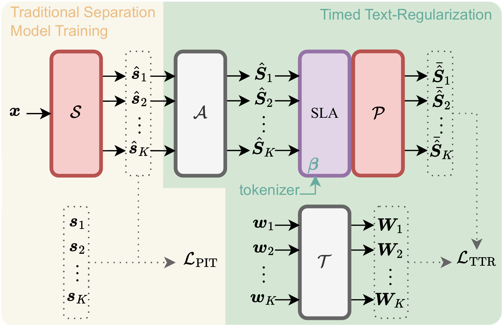

# Timed-Text-Regularization
Official Implementation of **Multimodal Representation Loss Between Timed Text and Audio for Regularized Speech Separation**
<div align="center">

</div>

# Data Preparation
Download the [LibriSpeech Alignments](https://github.com/CorentinJ/librispeech-alignments?tab=readme-ov-file) and run
```bash
unzip LibriSpeech-Alignments.zip
```
Download LibriMix and prepare the metadata using [Asteroid's recipe](https://github.com/asteroid-team/asteroid/tree/master/egs/librimix/ConvTasNet)

# Summarizer Transformer Pretraining
Pretrain the summarizer transformer with the modified LibriMix dataset by:
```bash
python train_summarizer.py
```
Download LibriMix and prepare the metadata using [Asteroid's recipe](https://github.com/asteroid-team/asteroid/tree/master/egs/librimix/ConvTasNet)
Details can be found in ```librimix_dataset.py```.

# Joint Training with Speech Separation Models
- The original code for joint training cannot be shared due to confidentiality restrictions.
- The loss module can be used after summarizer pretraining. Please check details in ```lm_loss.py```. Note that TTR is not used for deriving the order of the output source estimates.
- To combine TTR with PIT loss, we obtain the permutation matrix based on SI-SDR loss and reorder the output for final loss calcuation.
- Please import the LibriMix dataset from ```librimix_dataset.py``` by replace the original import line.

# Citation
Please cite our paper if you use this work:
```bibtex
@inproceedings{hsieh24b_interspeech,
  title     = {Multimodal Representation Loss Between Timed Text and Audio for Regularized Speech Separation},
  author    = {Tsun-An Hsieh and Heeyoul Choi and Minje Kim},
  year      = {2024},
  booktitle = {Interspeech 2024},
  pages     = {592--596},
  doi       = {10.21437/Interspeech.2024-1265},
  issn      = {2958-1796},
}
```

